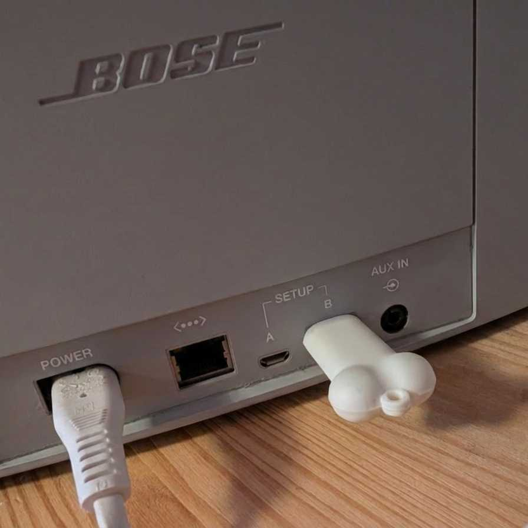
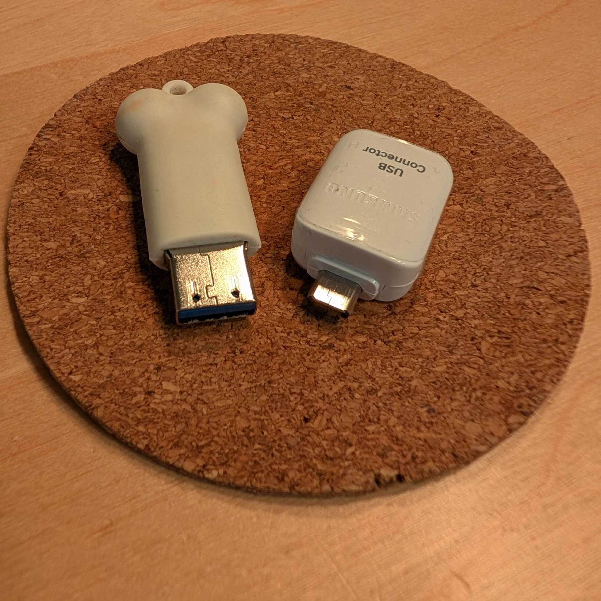
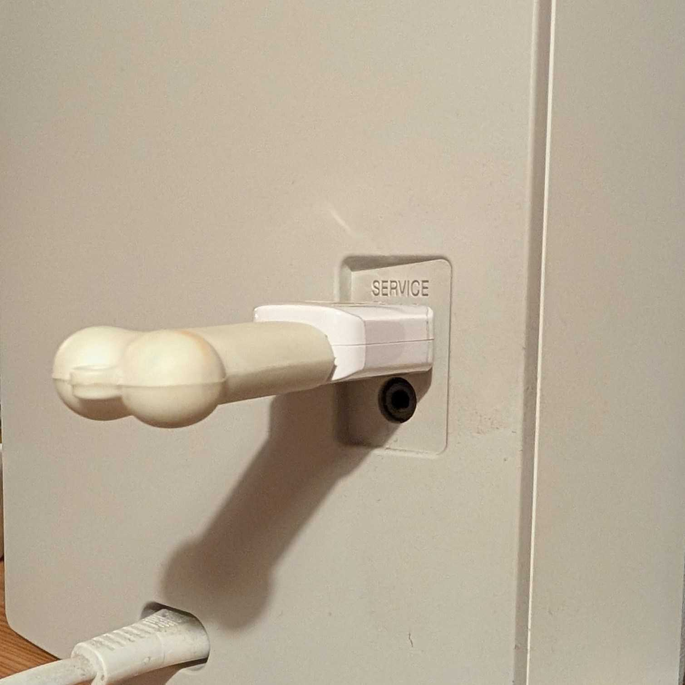

As described [here](https://flarn2006.blogspot.com/2014/09/hacking-bose-soundtouch-and-its-linux.html)
and [here](https://github.com/deborahgu/soundcork)
you can get a root shell into your speaker when you plug in a USB stick with an empty file called `remote_services`.

For me, it was a bit hard to figure out how the USB stick needed to be formatted,
so here is step-by-step guide to preparing your USB stick.

## Guide: Creating an EXT2 "Unlock" USB Stick

**OS:** Linux Command Line

### ⚠️ Warning

**This process deletes all data on the USB stick.**
Identify your USB drive letter carefully (e.g., `sdb`, `sdc`).
In this guide, we use **`sdX`**. Replace `X` with your actual letter.

---

### Step 1: Identify and Unmount

Plug in the USB stick into your Linux PC and find its name.

```bash
lsblk
# Look for your stick (e.g., /dev/sdc). We will use 'sdX' below.

```

Unmount it to ensure no files are busy.

```bash
sudo umount /dev/sdX*

```

### Step 2: Create MBR Partition Table

1. Open the partition tool:
```bash
sudo fdisk /dev/sdX

```

2. Type the following letters in order (press **Enter** after each):
* `o` (Create new DOS partition table)
* `n` (New partition)
* `p` (Primary)
* `1` (Partition number 1)
* *(Press Enter)* (Default first sector)
* *(Press Enter)* (Default last sector)
* `w` (Write changes and exit)

### Step 3: Format to Legacy EXT2

Format the new partition (`sdX1`) with 128-byte inodes.

```bash
sudo mkfs.ext2 -I 128 -b 4096 /dev/sdX1

```

### Step 4: Add the Trigger File

Mount the drive and create the "key" file that activates the services.

1. Create a mount point (if not exists):
```bash
sudo mkdir -p /mnt/usb

```

2. Mount the partition:
```bash
sudo mount /dev/sdX1 /mnt/usb

```

3. Create the magic file:
```bash
sudo touch /mnt/usb/remote_services

```

4. Unmount the drive to save the data.

```bash
sudo umount /mnt/usb

```

**Done.** You have prepared the USB Stick.


## Plug in the USB stick
Now it is time to plug in the stick.

<p align="center">
  
  
  
</p>

With the SoundTouch 20 it is very easy. Just use the USB-A port.

For the SoundTouch 10, you need an adapter.
For me an OTG-Adapter for micro-USB, that I got some years ago together with my smartphone, worked.

## Connect via telnet

After the USB-Stick is plugged in, use your computer to open the shell.

```bash
telnet 192.168.178.2
```
Replace `192.168.178.2` with the IP address of your speaker.

You should see something like that
```
... --- ..- -. -.. - --- ..- -.-. ....

        ____  ____  _____ _________
       / __ )/ __ \/ ___// _______/
      / __  / / / /\__ \/ __/
 ____/ /_/ / /_/ /___/ / /___
/_________/\____//____/_____/


spotty login: root
```
Type `root` as username.
No password is required. 😅

## Change the config on the speaker

To have **working internet radio**
and to let the **analytics data** be sent to your Überböse-API server instead of to `events.api.bosecm.com`
we have to change 2 lines in one file on the device.

```shell
cd /var/lib/Bose/PersistenceDataRoot
cat OverrideSdkPrivateCfg.xml

```
This should show
```xml
<SoundTouchSdkPrivateCfg>
    <margeServerUrl>http://ueberboese.your-example-host.org:8080</margeServerUrl>
    <statsServerUrl>https://events.api.bosecm.com</statsServerUrl>
    <swUpdateUrl>http://ueberboese-downloads.your-example-host.org:8080/updates/soundtouch</swUpdateUrl>
    <isZeroconfEnabled>true</isZeroconfEnabled>
    <usePandoraProductionServer>true</usePandoraProductionServer>
    <saveMargeCustomerReport>false</saveMargeCustomerReport>
    <bmxRegistryUrl>https://content.api.bose.io/bmx/registry/v1/services</bmxRegistryUrl>
</SoundTouchSdkPrivateCfg>
```
We need to change it to
```xml
<SoundTouchSdkPrivateCfg>
    <margeServerUrl>http://ueberboese.your-example-host.org:8080</margeServerUrl>
    <statsServerUrl>http://ueberboese.your-example-host.org:8080</statsServerUrl>
    <swUpdateUrl>http://ueberboese-downloads.your-example-host.org:8080/updates/soundtouch</swUpdateUrl>
    <isZeroconfEnabled>true</isZeroconfEnabled>
    <usePandoraProductionServer>true</usePandoraProductionServer>
    <saveMargeCustomerReport>false</saveMargeCustomerReport>
    <bmxRegistryUrl>http://ueberboese.your-example-host.org:8080/bmx/registry/v1/services</bmxRegistryUrl>
</SoundTouchSdkPrivateCfg>
```

You can do that via
```shell
HOST=$(grep -o '<margeServerUrl>[^<]*' OverrideSdkPrivateCfg.xml | sed 's|<margeServerUrl>||') && \
sed -i \
  -e "s|<statsServerUrl>.*</statsServerUrl>|<statsServerUrl>$HOST</statsServerUrl>|" \
  -e "s|<bmxRegistryUrl>.*</bmxRegistryUrl>|<bmxRegistryUrl>$HOST/bmx/registry/v1/services</bmxRegistryUrl>|" \
  OverrideSdkPrivateCfg.xml
```
Or you can use `vi` for that. (If you know `vi`)
```shell
vi OverrideSdkPrivateCfg.xml
```

And then restart the speaker via
```shell
reboot
```
